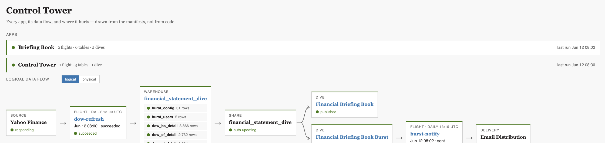
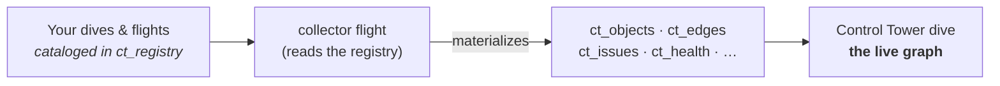

# Control Tower

The map and the monitor for your **MotherDuck pipelines** — the data-flow graph
across your warehouses, with live run health on every job. It charts every dive,
flight, table, and share and how data moves between them, drawn from a small
lineage catalog you keep — not a diagram you maintain by hand.



## Scope: many warehouses, many accounts

Control Tower isn't limited to one database. A single board charts every warehouse
you put in scope (`charted_databases` is a list), and a **main account folds in
other accounts' boards** over read-only shares — so one graph can span your whole
MotherDuck footprint, across accounts. Anything targeting a warehouse you haven't
charted is flagged **out-of-scope** (counted, with the database named) rather than
forced onto the graph. Control Tower's own `ct_*` bookkeeping tables live in a
dedicated `control_tower` database; it never modifies your data tables.

## How it works in 30 seconds

You don't draw the graph — you **catalog your objects** and Control Tower draws it.
You register each object's lineage once — what it reads, writes, and delivers — as a row
in a `ct_registry` table (via the build-manifest skill, without ever touching the object's
source). A scheduled collector flight reads the registry plus the live catalog, materializes
the lineage as `ct_*` tables, and the dive renders it — with row counts, run health, and a
warnings strip for anything not yet cataloged. Catalog an object, and it appears on the next
sync. Nothing is hardcoded.

## How it fits together



## What's here

```
control-tower/                     the dive (the console UI)
control-tower-collector/           the flight that builds the graph from the registry
build-manifest/                    the cataloging skill: SKILL.md + the registry scripts
control-tower.config.example.json  account topology template (copy → control-tower.config.json)
INSTALL.md                         step-by-step install guide (hand it to an agent)
```

## Install

Control Tower installs into your MotherDuck account — one collector flight, one
dive, and a handful of `ct_*` bookkeeping tables — and charts the warehouses you
put in scope; it never touches your data tables.

**Load [`INSTALL.md`](INSTALL.md) into the AI assistant of your choice** (Claude,
ChatGPT, Claude Code — anything that can run MotherDuck SQL) and tell it to
install Control Tower. The file is written *to the assistant*: it **preflights
first** — checks it can reach your account, that there's a read/write token, and
whether your plan has Flights — and if something's missing it names the exact
holdup and how to fix it before touching anything. Once it's clear, it stamps
your database in place of `YOUR_DATABASE`, deploys the flight, runs the first
sync, publishes the dive, and helps you catalog your existing objects one at a
time.

The three things it checks for, and what to do:
- **No MotherDuck access** → connect the [MotherDuck MCP](https://motherduck.com)
  to your assistant, *or* give it a read/write token + a Python env with
  `duckdb >= 1.5.3`.
- **No read/write token** → create one in MotherDuck → Settings → Access Tokens.
- **No Flights (free plan)** → install in **local-sync mode** instead — identical
  result, the graph just refreshes when you run the sync script rather than on a
  schedule. (Or upgrade for scheduling.)

No framework required — the install uses plain MotherDuck SQL, and the cataloging
step is driven by the `build-manifest/` folder in this repo (readable instructions
plus a few small Python scripts; works with any assistant).

## The lineage catalog

An object joins the graph by getting a row in the `ct_registry` table — written by
the **build-manifest skill**, which never edits the object's source. Each row
declares what the object reads, writes, and delivers:

```json
{
  "manifest_version": 1,
  "object": "daily-orders-load",
  "type": "flight",
  "app": "orders",
  "database": "analytics",
  "reads_from": ["source:shopify"],
  "writes_to": ["table:orders"]
}
```

Node refs are `type:name` (`table:`, `share:`, `source:`, `dive:`, `flight:`,
`delivery:`). Full field reference and the logical-vs-physical edge rules are in
**`build-manifest/references/manifest.md`**; the cataloging workflow is
`build-manifest/SKILL.md`.

## License

MIT — see [LICENSE](LICENSE).
